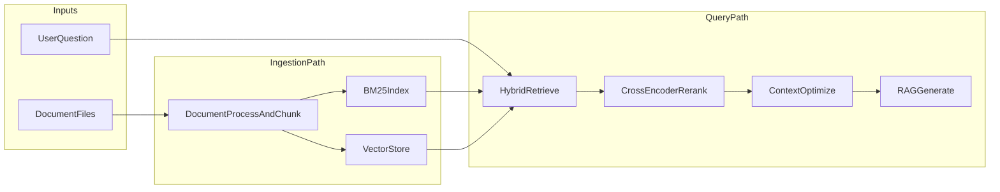
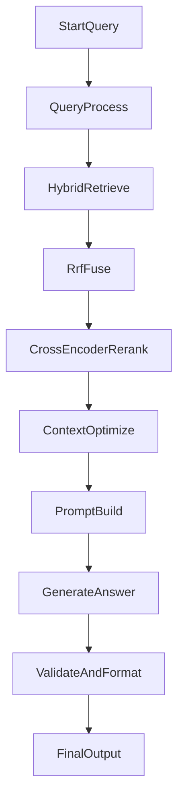

# Project Overview

Purpose: summarize what this project does, why it is useful, and how it is designed.  
Audience: first-time visitors, interviewers, and engineers doing a quick architecture review.  
Reading time: 4-6 minutes.

## What this project is

Doc-Ingestion is a local-first RAG system that converts document collections into grounded Q&A answers. Instead of querying a closed dataset or relying on a generic chatbot response, it retrieves evidence from user-provided files and builds answers from those sources.

## Problem statement

Teams often store information across PDFs, markdown notes, and text files. Finding reliable answers is slow and error-prone when search is weak and responses are not grounded. This project addresses that by combining lexical and semantic retrieval with a generation layer designed to stay tied to retrieved context.

## Solution summary

- Ingest and normalize multiple document formats.
- Build both sparse and dense indexes.
- Combine retrieval results using reciprocal rank fusion.
- Improve ranking quality with cross-encoder reranking.
- Optimize context and generate responses through Ollama.
- Evaluate retrieval and generation quality with explicit metrics modules.

## Architecture at a glance

## Query lifecycle

## Why this is a strong portfolio project

- Demonstrates full-stack AI system design, not just prompt calls.
- Shows quality focus through retrieval and generation evaluation modules.
- Uses practical local inference workflows (Ollama) and production-minded retrieval abstractions.
- Includes modular code boundaries that support iteration and extension.

## Where to go deeper

- Root documentation: [`../README.md`](../README.md)
- Docs hub: [`README.md`](README.md)
- Hybrid retrieval internals: [`phase2_hybrid_retrieval.md`](phase2_hybrid_retrieval.md)
- Reranking and generation plan: [`phase3_reranking_generation.md`](phase3_reranking_generation.md)
- Public progress: [`ROADMAP.md`](ROADMAP.md)
