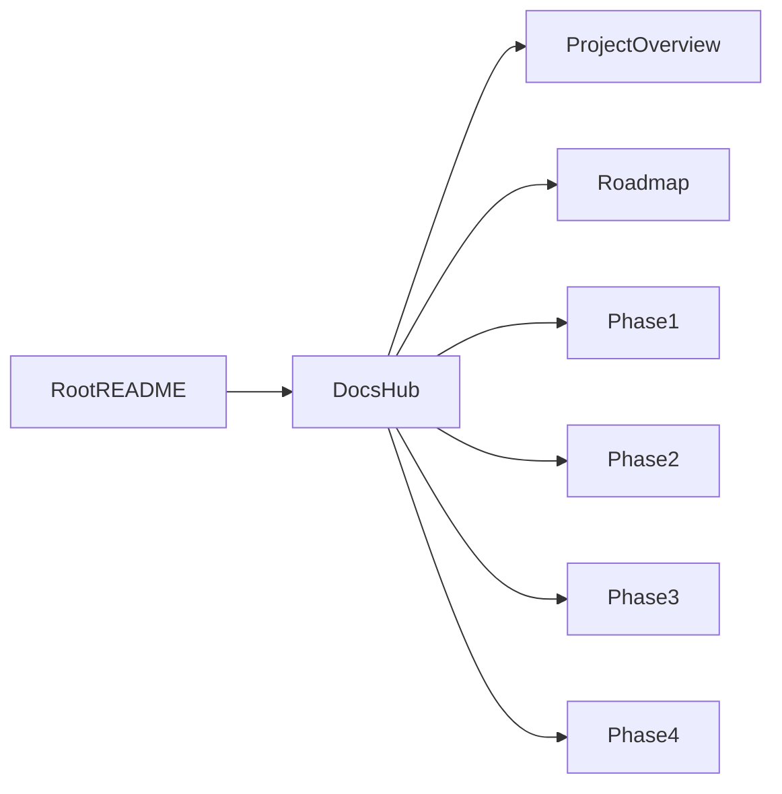

# Documentation Hub

Purpose: help different readers find the right project information quickly.  
Audience: visitors, engineering reviewers, and contributors.  
Reading time: 2-3 minutes.

## Start here by audience

- First-time visitors and interview loops: [`PROJECT_OVERVIEW.md`](PROJECT_OVERVIEW.md)
- Engineers evaluating architecture: [`phase2_hybrid_retrieval.md`](phase2_hybrid_retrieval.md), [`phase3_reranking_generation.md`](phase3_reranking_generation.md)
- Contributors and maintainers: project root [`README.md`](../README.md)

## Documentation map

## Core docs

- Project summary and outcomes: [`PROJECT_OVERVIEW.md`](PROJECT_OVERVIEW.md)
- Public phase progress: [`ROADMAP.md`](ROADMAP.md)
- Foundation/infrastructure: [`phase1_core_infrastructure.md`](phase1_core_infrastructure.md)
- Hybrid retrieval details: [`phase2_hybrid_retrieval.md`](phase2_hybrid_retrieval.md)
- Reranking + generation: [`phase3_reranking_generation.md`](phase3_reranking_generation.md)
- Citation and API work: [`phase4_citation_api.md`](phase4_citation_api.md)

## Repo quick links

- Main project guide: [`../README.md`](../README.md)
- Query CLI entrypoint: [`../src/query.py`](../src/query.py)
- Core retrieval module: [`../src/core/hybrid_retriever.py`](../src/core/hybrid_retriever.py)
