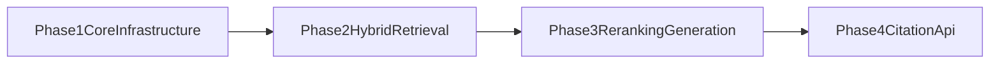

# Project Roadmap

Purpose: provide a concise public view of project progress and what is next.  
Audience: visitors, collaborators, and contributors.  
Reading time: 3-4 minutes.

## Roadmap timeline

## Current status by phase

| Phase | Focus | Status |
|---|---|---|
| Phase 1 | Core ingestion pipeline and storage foundations | Completed |
| Phase 2 | Hybrid retrieval, RRF fusion, query understanding | Completed |
| Phase 3 | Reranking and generation pipeline improvements | In progress |
| Phase 4 | Citation fidelity and API surface hardening | Planned |

## Phase summaries

### Phase 1: Core infrastructure

- Multi-format extraction and chunking.
- BM25 indexing and vector store integration.
- Ingestion CLI flow.

Reference: [`phase1_core_infrastructure.md`](phase1_core_infrastructure.md)

### Phase 2: Hybrid retrieval

- Query processing and intent detection.
- BM25 + vector retrieval fusion via RRF.
- Retrieval metrics and tests.

Reference: [`phase2_hybrid_retrieval.md`](phase2_hybrid_retrieval.md)

### Phase 3: Reranking and generation

- Cross-encoder reranking.
- Context optimization and prompt management.
- Streaming response generation and quality post-processing.

Reference: [`phase3_reranking_generation.md`](phase3_reranking_generation.md)

### Phase 4: Citation and API

- Citation accuracy and traceability.
- Response metadata and public API polish.
- Confidence scoring and observability improvements.

Reference: [`phase4_citation_api.md`](phase4_citation_api.md)

## Near-term priorities

- Strengthen automated tests for generation and reranking modules.
- Add benchmark snapshots for retrieval and generation quality.
- Improve contributor onboarding with a short architecture walkthrough.

## Related docs

- Root README: [`../README.md`](../README.md)
- Docs index: [`README.md`](README.md)
- Project overview: [`PROJECT_OVERVIEW.md`](PROJECT_OVERVIEW.md)
