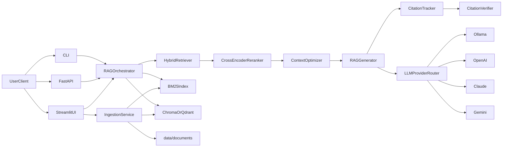
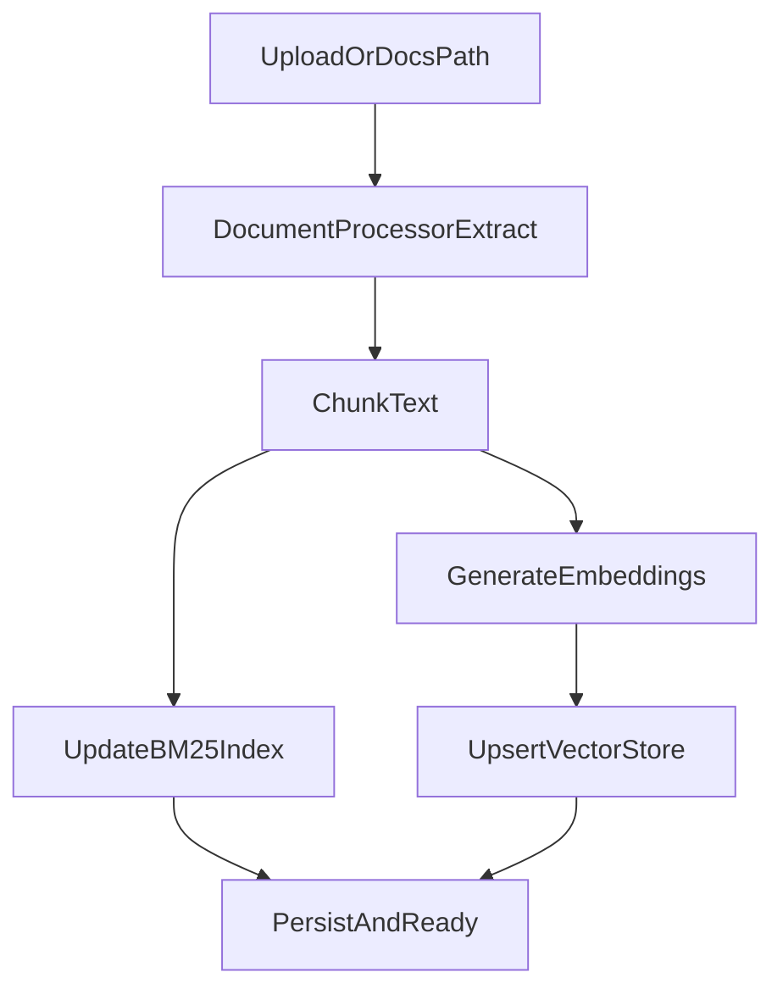
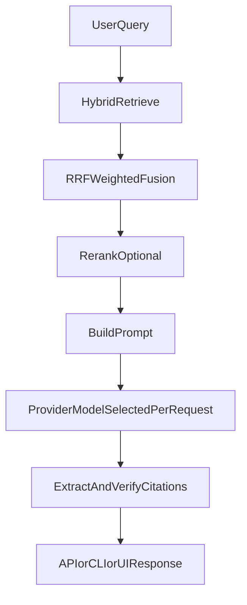

# Doc-Ingestion

Doc-Ingestion is a local-first RAG system for ingesting files, retrieving grounded context, and generating citation-aware answers through CLI, API, and Streamlit UI.

## What is implemented

- Multi-format ingestion (`.pdf`, `.docx`, `.txt`, `.md`, `.html`)
- Hybrid retrieval (BM25 + vector) with weighted reciprocal-rank fusion
- Optional cross-encoder reranking
- Citation tracking and verification in generation responses
- FastAPI endpoints: `/query`, `/health`, `/metrics`
- Streamlit UI with:
  - per-request provider/model switching
  - upload + ingest tab
- Multi-provider LLM routing:
  - Ollama (local)
  - OpenAI
  - Anthropic Claude
  - Gemini

## Architecture



### Ingestion flow



### Query flow



## Quickstart

### 1) Setup

```bash
git clone <your-repo-url>
cd Doc-Ingestion
python3 -m venv .venv
source .venv/bin/activate
pip install -r requirements/base.txt
```

### 2) Local model prerequisites (Ollama)

```bash
ollama pull nomic-embed-text
ollama pull qwen2.5:7b
```

Recommended cache setup for reranker model downloads:

```bash
export HF_HOME="$HOME/.cache/huggingface"
export TRANSFORMERS_CACHE="$HF_HOME/transformers"
export SENTENCE_TRANSFORMERS_HOME="$HF_HOME/sentence_transformers"
```

Optional offline mode after cache warmup:

```bash
export HF_HUB_OFFLINE=1
export TRANSFORMERS_OFFLINE=1
```

### 3) Ingest documents

```bash
python -m src.ingest --docs data/documents
```

### 4) Query from CLI

```bash
python -m src.query "What are the key project phases?"
```

## API usage

Run server:

```bash
uvicorn src.api.main:app --reload --port 8000
```

Endpoints:

- `GET /health`
- `GET /metrics`
- `POST /query`
- `POST /query/stream` (SSE)

Example:

```bash
curl -X POST http://127.0.0.1:8000/query \
  -H "X-API-Key: your-api-key" \
  -H "Content-Type: application/json" \
  -d '{
    "query":"How does hybrid retrieval work?",
    "provider":"ollama",
    "model":"qwen2.5:7b",
    "top_k":5,
    "include_citations":true
  }'
```

Streaming example (`curl`, SSE):

```bash
curl -N -X POST http://127.0.0.1:8000/query/stream \
  -H "X-API-Key: your-api-key" \
  -H "Content-Type: application/json" \
  -d '{
    "query":"Stream an explanation of hybrid retrieval",
    "provider":"openai",
    "model":"gpt-4o-mini",
    "stream":true
  }'
```

Streaming example (Python):

```python
import json
import requests

url = "http://127.0.0.1:8000/query/stream"
payload = {
    "query": "Stream an explanation of hybrid retrieval",
    "provider": "anthropic",
    "model": "claude-3-5-sonnet-latest",
    "stream": True,
}
headers = {"Content-Type": "application/json", "X-API-Key": "your-api-key"}

with requests.post(url, json=payload, headers=headers, stream=True, timeout=120) as resp:
    resp.raise_for_status()
    for line in resp.iter_lines(decode_unicode=True):
        if not line or not line.startswith("data:"):
            continue
        data = line[5:].strip()
        if data == "[DONE]":
            break
        event = json.loads(data)
        if event.get("type") == "token":
            print(event["text"], end="", flush=True)
        elif event.get("type") == "final":
            print("\n\nCitations:", event.get("citations", []))
```

## Streamlit UI

Run:

```bash
streamlit run src/web/streamlit_app.py
```

If API auth is enabled, set the UI client key first:

```bash
export DOC_API_KEY=your-api-key
PYTHONPATH=. streamlit run src/web/streamlit_app.py
```

### Query tab

- Enter prompt
- Pick provider and model for that request
- Submit and view answer, citations, retrieved chunks

### Ingest tab

- Upload supported files
- Click `Ingest`
- App stages files, runs ingestion pipeline, updates BM25 + vector indexes

## Multi-provider configuration

Set API keys for cloud providers (only needed if using them):

```bash
export OPENAI_API_KEY=...
export ANTHROPIC_API_KEY=...
export GEMINI_API_KEY=...
```

Optional endpoints:

```bash
export OLLAMA_BASE_URL=http://localhost:11434
export OPENAI_BASE_URL=https://api.openai.com/v1
export ANTHROPIC_BASE_URL=https://api.anthropic.com/v1
export GEMINI_BASE_URL=https://generativelanguage.googleapis.com/v1beta
```

Provider/model defaults and allowlists live in `config.yaml` under `llm`.

## Performance baseline

Framework-only API overhead baseline:

```bash
PYTHONPATH=. .venv/bin/python scripts/perf_baseline.py
```

Latest recorded metrics are in `Docs/performance_baseline.md`.

For Docker setup, copy environment template before compose runs:

```bash
cp docker/.env.example docker/.env
```

## Production Runbook

### 1) Secure API access

- Enable API auth in `config.yaml`:
  - `api.auth_enabled: true`
  - `api.api_keys: []` (or set `DOC_API_KEYS` env var with comma-separated keys)
- Send `X-API-Key` on protected endpoints:
  - `POST /query`
  - `POST /query/stream`
  - `GET /metrics`
- Keep `GET /health` unauthenticated for probes.

### 2) Rate limiting

- Configure `api.rate_limit_per_minute` in `config.yaml`.
- Distributed limiter (recommended):
  - `api.redis_rate_limit_enabled: true`
  - `api.redis_url: redis://localhost:6379/0`
- Redis-backed rate limiting is applied per API key (or client IP if auth is disabled).
- If Redis is unavailable, API falls back to in-memory limiter as a safety path.

### 3) Environment and secrets

- Required for cloud providers:
  - `OPENAI_API_KEY`
  - `ANTHROPIC_API_KEY`
  - `GEMINI_API_KEY`
- Optional provider URLs:
  - `OPENAI_BASE_URL`
  - `ANTHROPIC_BASE_URL`
  - `GEMINI_BASE_URL`
  - `OLLAMA_BASE_URL`
- Store secrets in a secret manager or runtime env, never in git-tracked files.

### 4) Deploy API

```bash
source .venv/bin/activate
uvicorn src.api.main:app --host 0.0.0.0 --port 8000 --workers 2
```

- Place behind Nginx/ALB/API gateway with TLS termination.
- Set request/body/time limits at the edge.
- Prefer provider egress allow-listing where possible.

### 5) Streaming operations

- Use `POST /query/stream` for SSE token streaming.
- Cloud providers now use true upstream streaming parsers (OpenAI/Anthropic/Gemini).
- Client should handle SSE events:
  - `type=token`
  - `type=final`
  - `[DONE]`

### 6) Observability and incident response

- Baseline health checks:
  - `GET /health`
  - `GET /metrics` (with key)
- Structured auth/query audit logs are emitted from API middleware path as JSON records:
  - `auth_success`, `auth_failed`
  - `query_success`, `query_failed`
  - `stream_success`, `stream_failed`
- Track:
  - 4xx/5xx rates
  - p95 latency
  - provider error rates
  - rate-limit rejections (429)
- If latency spikes:
  1. Switch provider/model to known-fast fallback.
  2. Lower `top_k` and/or disable rerank temporarily.
  3. Verify vector store and BM25 availability.

### 7) Rollback checklist

1. Revert to previous release tag/commit.
2. Restart API workers.
3. Run smoke tests:
   - `GET /health`
   - one authenticated `POST /query`
4. Validate ingestion + query end-to-end on a known document.

## Project map

- `src/core/` retrieval, reranking, generation, citations, orchestration
- `src/api/` FastAPI models and routes
- `src/web/` Streamlit UI and ingestion helper
- `src/utils/` config and vector database integrations
- `src/ingest.py` ingestion CLI
- `src/query.py` query CLI
- `Docs/` roadmap and phase docs
- `tests/` unit and integration tests

## Development

```bash
.venv/bin/python -m pytest tests/unit -q
.venv/bin/python -m pytest tests/integration -q
```

## Documentation

- [Docs hub](Docs/README.md)
- [Project overview](Docs/PROJECT_OVERVIEW.md)
- [Roadmap](Docs/ROADMAP.md)
- [Runbook](Docs/RUNBOOK.md)
- [Phase 4 plan target](Docs/phase4_citation_api.md)

## Troubleshooting

- If API cloud provider fails, verify required API key env var is present.
- If retrieval returns empty results, ingest documents again and verify `data/embeddings/` exists.
- If embedding model changes, re-ingest documents to avoid vector dimension mismatch.
