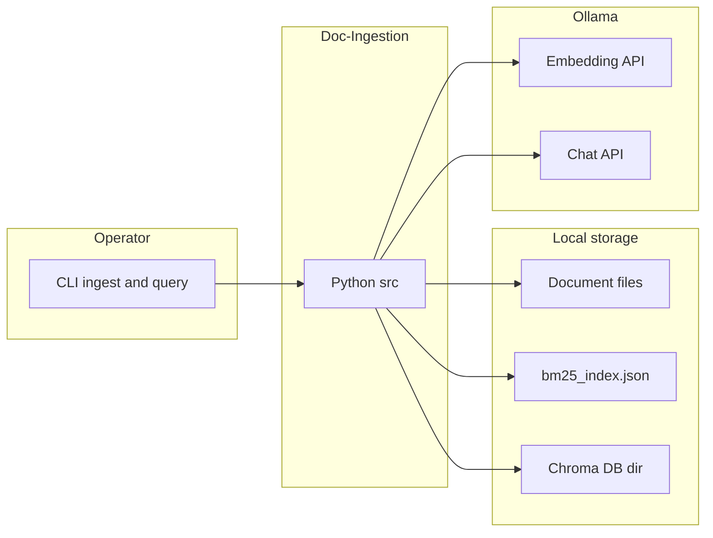
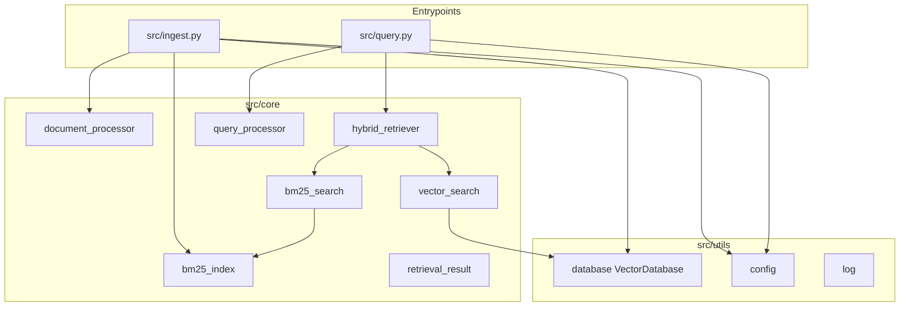
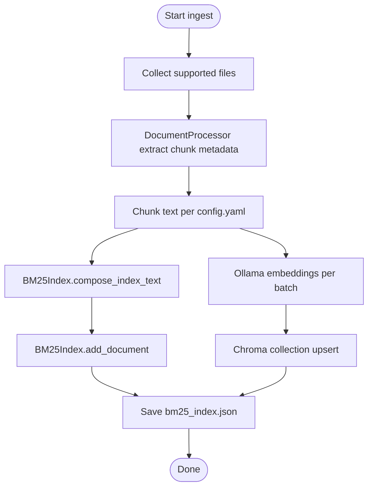
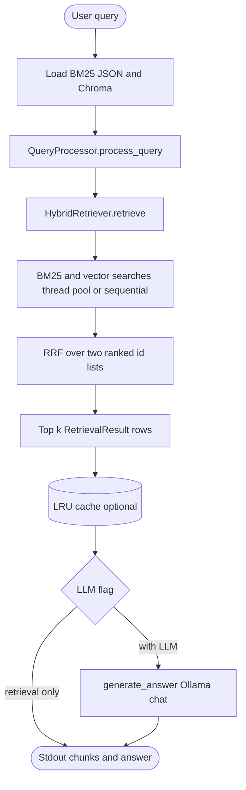
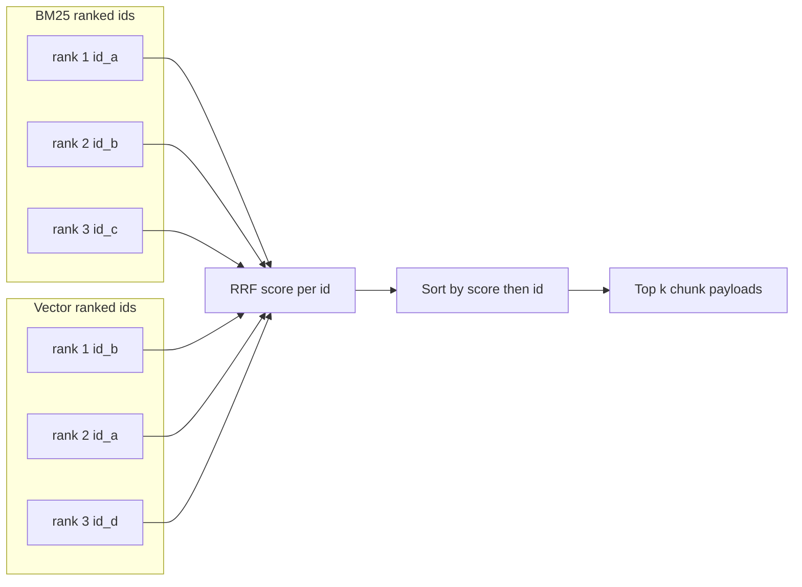

# Doc-Ingestion

Local-first **document ingestion**, **hybrid retrieval** (sparse + dense), and **LLM-grounded Q&A** over your own files. Phase 1 covers extraction, chunking, BM25 indexing, and Chroma vector storage. Phase 2 adds query understanding, **reciprocal rank fusion (RRF)**, evaluation helpers, and a small CLI.

---

## Table of contents

- [Features](#features)
- [Tech stack](#tech-stack)
- [Architecture](#architecture)
  - [System context](#system-context)
  - [Code components](#code-components)
  - [Ingestion pipeline](#ingestion-pipeline)
  - [Query pipeline](#query-pipeline)
  - [RRF fusion](#rrf-fusion)
- [Prerequisites](#prerequisites)
- [Installation](#installation)
- [Ingest documents](#ingest-documents)
- [Query documents](#query-documents)
- [Retrieval strategy](#retrieval-strategy)
- [Local models (Ollama)](#local-models-ollama)
- [Configuration](#configuration)
- [Development](#development)
- [Project layout](#project-layout)
- [Roadmap](#roadmap)

---

## Features

- **Formats:** PDF, DOCX, TXT, Markdown, HTML (see `DocumentProcessor`).
- **Chunking:** Configurable size and overlap (`config.yaml`).
- **Sparse retrieval:** Custom **BM25** index persisted to JSON; optional **title/metadata weighting** in the indexed text (display text stays chunk-only).
- **Dense retrieval:** **ChromaDB** (dev) or **Qdrant** (prod path in code) with embeddings from **Ollama**.
- **Hybrid fusion:** **RRF** over BM25-ranked and vector-ranked chunk IDs, then top‑`k` passed to the chat model.
- **Query layer:** Normalization, stop-word trimming, light synonym expansion, heuristic intent.
- **Evaluation:** Pure-Python IR metrics (`precision@k`, recall, F1, MRR, MAP, NDCG, etc.) under `src/evaluation/`.

---

## Tech stack

| Layer | Technology |
|--------|------------|
| Language | Python **3.13** (see CI) |
| Document parsing | PyPDF2, python-docx, BeautifulSoup |
| Sparse index | In-house **BM25** (`src/core/bm25_index.py`) |
| Vector store (default) | **ChromaDB** persistent client |
| Vector store (alternate) | **Qdrant** (`VectorDatabase(mode="prod")`) |
| Embeddings | **Ollama** — `nomic-embed-text` (768-d), via `ollama` Python client |
| Chat / answers | **Ollama** — any pulled chat model (default: `deepseek-r1:8b`) |
| Config | YAML + `pydantic` / utilities in `src/utils/config.py` |
| Tests | `pytest` (unit + integration; Ollama mocked in tests where noted) |

Dependencies are listed in [`requirements/base.txt`](requirements/base.txt).

---

## Architecture

High-level view: **ingest** builds a lexical index and a vector store; **query** runs both retrievers, **fuses ranks with RRF**, then optionally calls a **local chat model** to summarize grounded context.

### System context



### Code components



Offline IR metrics and fixtures live under `src/evaluation/` and `tests/fixtures/` (not on the hot query path).

### Ingestion pipeline



### Query pipeline

End-to-end path for `python -m src.query` (retrieval runs inside `HybridRetriever.retrieve`; the LLM step is in `query.py` after fusion).



### RRF fusion

Only **ordered chunk ids** from BM25 and from Chroma participate. Raw BM25 and distance scores are **not** mixed mathematically; ranks are merged with a standard RRF score per id.



**Merge step (after scores):** `HybridRetriever` re-attaches `text`, `metadata`, BM25 score, and vector distance from the hit maps to build [`RetrievalResult`](src/core/retrieval_result.py) rows for the LLM context.

---

## Prerequisites

1. **Python 3.13** (or align with your environment; CI uses 3.13).
2. **[Ollama](https://ollama.com/)** installed and running locally.
3. Pull models you will use (minimum for the default code paths):

   ```bash
   ollama pull nomic-embed-text
   ollama pull deepseek-r1:8b
   ```

   `nomic-embed-text` is used for **embeddings** during ingest and vector search. The **chat** model is configurable (see below).

---

## Installation

```bash
git clone git@github.com:vampokala/doc-ingestion.git
cd doc-ingestion

python3 -m venv .venv
source .venv/bin/activate   # Windows: .venv\Scripts\activate

pip install -r requirements/base.txt
pip install pytest          # optional, for running tests like CI
```

Verify Ollama:

```bash
ollama list
```

---

## Ingest documents

Put files under a folder (e.g. `data/documents/`) or point at a single file. Supported extensions: `.pdf`, `.docx`, `.txt`, `.md`, `.html`.

```bash
python -m src.ingest --docs data/documents
```

This will:

- Read [`config.yaml`](config.yaml) for `chunk_size` and `overlap`.
- Write **BM25** index to `data/embeddings/bm25_index.json`.
- Write **Chroma** data under `data/embeddings/chroma/` (collection name: `documents`).

Optional post-ingest smoke query (prints BM25 and vector lists separately):

```bash
python -m src.ingest --docs data/documents --query "your keywords" --top-k 5
```

> **Note:** `data/embeddings/` is gitignored by default (generated artifacts). Re-run ingest after cloning or when the corpus changes.

---

## Query documents

Hybrid retrieval + optional LLM answer:

```bash
python -m src.query "What is hybrid retrieval?"
python -m src.query "Explain chunking" --top-k 8
python -m src.query "keywords only" --no-llm
```

- **`--top-k`:** Number of fused chunks sent to the model (default `5`).
- **`--no-llm`:** Show retrieval only (BM25 + Chroma fused); no chat call.
- **`--model`:** Ollama chat model name (overrides default).
- **Env `OLLAMA_QUERY_MODEL`:** Default chat model if set.

Example:

```bash
export OLLAMA_QUERY_MODEL=qwen2.5-coder:14b
python -m src.query "How does BM25 scoring work?"
```

---

## Retrieval strategy

### 1. Query processing

[`QueryProcessor`](src/core/query_processor.py) builds a `ProcessedQuery`:

- Lowercasing and light normalization.
- Stop-word removal and tokenization.
- Small synonym table for expansion (used to build the **BM25 query string**).
- Heuristic **intent** (factual / exploratory / comparative) and a simple **complexity** flag.

The **vector** leg uses the **original user question**; the **BM25** leg uses the **joined expanded tokens** so keyword recall can improve.

### 2. Dual retrieval

- **BM25:** `BM25Search` → `BM25Index.score()` over the persisted inverted index.
- **Vector:** `VectorSearch` → Chroma similarity search using an embedding of the query from Ollama.

Each leg requests a **candidate pool** (by default up to 50 hits, or `max(top_k, 50)`), so fusion sees more than the final `k`.

### 3. Reciprocal Rank Fusion (RRF)

Fusion is implemented in [`src/core/hybrid_retriever.py`](src/core/hybrid_retriever.py). Only **ranks** matter, not raw BM25 vs cosine scores (so scales do not need alignment).

For each chunk id \(d\) appearing in either ranked list:

\[
\text{RRF}(d) = \sum_{\text{list } i} \frac{1}{k_{\text{rrf}} + \text{rank}_i(d)}
\]

- \(\text{rank}_i(d)\) is **1-based** in that list.
- If \(d\) is missing from a list, that list contributes **0** for \(d\).
- Default **`k_rrf = 60`** (`FusionConfig`), which dampens rank sensitivity.
- Final ordering: sort by **RRF score descending**, then by **chunk id** ascending for stable ties.

The top **`k`** fused results become [`RetrievalResult`](src/core/retrieval_result.py) rows (text, metadata, per-leg ranks, fused score, `sources`, heuristic confidence). The CLI maps them to legacy dicts for printing and for the LLM context block.

### 4. Caching and parallelism

- Optional **in-process LRU** cache on the hybrid retriever (keyed by queries + fusion parameters + collection name).
- BM25 and vector calls can run in **parallel** via a thread pool (`FusionConfig.parallel`).

### 5. Why hybrid + RRF?

- **BM25** excels at lexical overlap (names, acronyms, rare terms).
- **Dense retrieval** excels at paraphrase and semantic neighborhood.
- **RRF** combines two rankers without normalizing incompatible scores and tends to improve robustness over “concat BM25 then vector” or score averaging.

---

## Local models (Ollama)

| Role | Config location | Default model |
|------|-----------------|---------------|
| **Embeddings** (ingest + vector search) | [`src/utils/database.py`](src/utils/database.py) `OLLAMA_MODEL` | `nomic-embed-text` |
| **Chat** (answer generation) | [`src/query.py`](src/query.py) `DEFAULT_LLM_MODEL` / `--model` / `OLLAMA_QUERY_MODEL` | `deepseek-r1:8b` |

To use a different embedding model you would change `OLLAMA_MODEL` and ensure **Chroma collection dimension** matches the new model (re-ingest after any embedding change).

Chat models must be pulled in Ollama, e.g.:

```bash
ollama pull deepseek-r1:8b
ollama pull qwen2.5-coder:14b
```

---

## Configuration

| File | Purpose |
|------|---------|
| [`config.yaml`](config.yaml) | `chunk_size`, `overlap`, paths for data/output (used by ingest / config loader). |
| [`src/query.py`](src/query.py) | Paths: `BM25_INDEX_PATH`, `CHROMA_PATH`, `COLLECTION_NAME`; default LLM. |
| [`src/ingest.py`](src/ingest.py) | Same BM25 path and Chroma path defaults as query flow. |

---

## Development

```bash
# Lint (matches CI)
pip install ruff
ruff check src/ tests/

# Typecheck (matches CI)
pip install -r requirements/base.txt mypy types-PyYAML types-beautifulsoup4 types-requests
mypy src/ --ignore-missing-imports

# Tests
pip install -r requirements/base.txt pytest
pytest tests/unit/ -v
pytest tests/integration/ -v
```

CI is defined in [`.github/workflows/ci.yml`](.github/workflows/ci.yml).

---

## Project layout

```
src/
  core/           # BM25, hybrid retriever, query processor, document processor
  evaluation/    # retrieval_metrics
  ingest.py       # CLI: folder/file → BM25 + Chroma
  query.py        # CLI: hybrid retrieve + optional Ollama answer
  utils/          # config, logging, VectorDatabase (Chroma / Qdrant)
tests/
  unit/
  integration/
  fixtures/       # e.g. qrels for metric tests
Docs/             # phase specs (design docs)
```

Design references: [`Docs/phase1_core_infrastructure.md`](Docs/phase1_core_infrastructure.md), [`Docs/phase2_hybrid_retrieval.md`](Docs/phase2_hybrid_retrieval.md).

---

## Roadmap

- **Phase 3:** Reranking and generation improvements (see [`Docs/phase3_reranking_generation.md`](Docs/phase3_reranking_generation.md) and `data/documents/` copies if present).
- **Phase 4:** Citations / API surface (see [`Docs/phase4_citation_api.md`](Docs/phase4_citation_api.md)).

---

## License

Specify your license here (repository default not set in this README).
