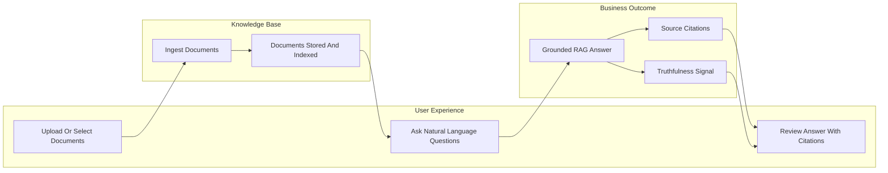
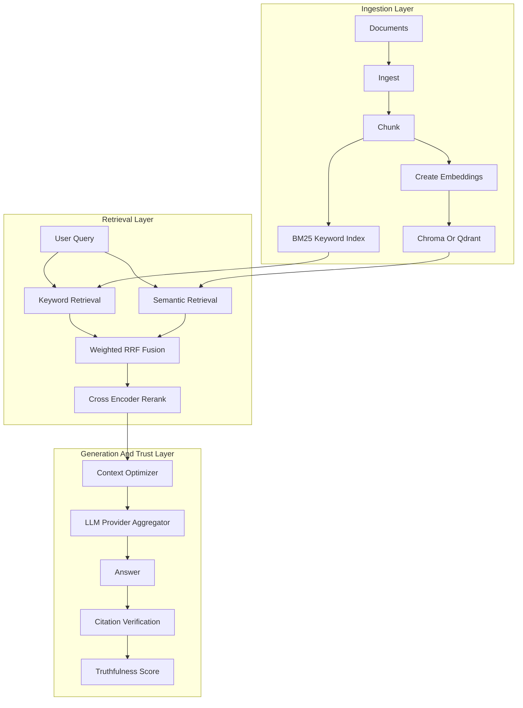

# Doc-Ingestion

Doc-Ingestion is a citation-aware RAG system that turns private document collections into grounded question-answering experiences. It demonstrates how to ingest documents, retrieve the right evidence, generate answers from that evidence, and return citations plus truthfulness signals through a React UI (served by FastAPI), standalone FastAPI, optional Streamlit legacy UI, and CLI.

> **[Try the live demo on Hugging Face Spaces](https://huggingface.co/spaces/vampokala/doc-ingestion)** - no install required.

## Why This Project Exists

Most teams have knowledge scattered across PDFs, Word docs, markdown notes, text files, and HTML exports. Traditional search can find matching words, but it does not synthesize answers. Generic LLMs can synthesize answers, but they may not know what is inside your documents and can hallucinate without evidence.

This project solves that gap: ingest your documents, ask natural-language questions, and receive answers grounded in retrieved source chunks with citations and quality signals.

## What It Showcases

For non-technical reviewers, this is a working document Q&A product: load documents, ask questions, inspect answers, and verify sources.

For technical reviewers, this is an end-to-end RAG reference implementation with:

- Multi-format ingestion for `.pdf`, `.docx`, `.txt`, `.md`, and `.html`
- Token-aware chunking and persistent document indexes
- Hybrid retrieval using BM25 keyword search plus vector search
- Weighted Reciprocal Rank Fusion (RRF) across sparse and dense results
- Optional cross-encoder reranking for stronger final context
- Multi-provider LLM routing across Ollama, OpenAI, Anthropic, and Gemini
- Citation tracking, citation verification, and inline truthfulness scoring
- FastAPI, Streamlit, CLI, Docker, Redis-backed rate limiting, and offline evals

## Product Capabilities

This is the user-facing flow: documents become a searchable knowledge base, and users ask questions against that knowledge base instead of relying on ungrounded model memory.



## Under The Hood

The technical pipeline combines ingestion, sparse retrieval, semantic retrieval, rank fusion, reranking, model routing, citation verification, and answer scoring.



## How Answer Quality Is Protected

Doc-Ingestion is designed around a grounding contract: retrieve evidence first, generate from that evidence, then report how well the answer is supported.

- **Hybrid retrieval:** BM25 catches exact terms, acronyms, and names; vector search catches semantic matches. The results are fused with weighted RRF in [`src/core/hybrid_retriever.py`](src/core/hybrid_retriever.py).
- **Reranking:** A cross-encoder reranker narrows the final context before generation in [`src/core/reranker.py`](src/core/reranker.py).
- **Context control:** Retrieved chunks are packed into the prompt within a configured token budget in [`src/core/context_optimizer.py`](src/core/context_optimizer.py).
- **Provider routing:** The same query path can route to Ollama, OpenAI, Anthropic, or Gemini through [`src/core/llm_provider.py`](src/core/llm_provider.py).
- **Citations:** Generated citation markers are mapped back to retrieved chunks by [`src/core/citation_tracker.py`](src/core/citation_tracker.py) and verified by [`src/core/citation_verifier.py`](src/core/citation_verifier.py).
- **Truthfulness:** Each response can include NLI faithfulness and citation groundedness from [`src/evaluation/truthfulness.py`](src/evaluation/truthfulness.py).

## What You Can Try

- Use the hosted [Hugging Face Spaces demo](https://huggingface.co/spaces/vampokala/doc-ingestion) with preloaded sample documents.
- Upload or ingest your own files locally.
- Ask questions through Streamlit, FastAPI, or the CLI.
- Inspect answers, citations, source evidence, and truthfulness scores.
- Switch LLM providers and models per request when credentials are configured.

In hosted demo mode (`DOC_PROFILE=demo`), Streamlit executes queries in-process through the shared orchestrator so the demo is not blocked by localhost API startup races. Local non-demo mode uses the standard split architecture where Streamlit calls FastAPI over HTTP.

## Tech Stack Snapshot

- **App and API:** Streamlit, FastAPI, Pydantic, Uvicorn
- **Document processing:** PyPDF2, python-docx, BeautifulSoup, markdown parsing, token-aware chunking
- **Retrieval:** BM25, Chroma, Qdrant, sentence-transformers, Ollama embeddings
- **Ranking:** weighted RRF fusion, `cross-encoder/ms-marco-MiniLM-L-6-v2`
- **Generation:** Ollama, OpenAI, Anthropic, Gemini
- **Evaluation:** NLI faithfulness, citation groundedness, golden datasets, RAGAS-style offline harness
- **Operations:** Docker Compose, Redis-backed rate limiting with in-memory fallback, Hugging Face Spaces deployment

## Quickstart

### Try Online

Open the [Hugging Face Spaces demo](https://huggingface.co/spaces/vampokala/doc-ingestion). Sample documents about RAG, vector databases, and BM25 are preloaded. Paste your OpenAI, Anthropic, or Gemini key in the app if you want to use a cloud provider.

### Run Locally With Docker

```bash
git clone https://github.com/vampokala/Doc-Ingestion
cd Doc-Ingestion
cp docker/.env.example docker/.env
# Edit docker/.env to add your API keys if needed.
docker compose -f docker/docker-compose.yml up
```

Open `http://localhost:8000` for the React UI and API (single container image).

### Run From Source

```bash
git clone https://github.com/vampokala/Doc-Ingestion
cd Doc-Ingestion
bash scripts/bootstrap_demo.sh
```

The bootstrap script creates a virtual environment, installs dependencies, ingests sample documents, and pulls Ollama models when Ollama is installed.

```bash
source .venv/bin/activate

# API server
PYTHONPATH=. uvicorn src.api.main:app --reload --port 8000

# Streamlit UI in a second terminal
PYTHONPATH=. streamlit run src/web/streamlit_app.py

# CLI query
PYTHONPATH=. python -m src.query "What is RAG?"
```

For a full local and Docker runbook, see [`Docs/RUNBOOK.md`](Docs/RUNBOOK.md).

## Ollama and Hugging Face Spaces

**`SPACE_ID` is not a file in this repository.** It is a **runtime environment variable** that [Hugging Face Spaces](https://huggingface.co/docs/hub/spaces-overview) sets inside the Space container (for example `your-username/your-space-name`). Doc-Ingestion reads it from the process environment in [`src/utils/config.py`](src/utils/config.py) when `load_config("config.yaml")` runs. Static LLM provider and model lists still live in [`config.yaml`](config.yaml); Ollama is only removed from the **effective** config when Space detection says it should be.

If you **clone this repo and run it locally** (source or Docker on your machine), **Hugging Face does not set `SPACE_ID`**. The Ollama provider therefore stays in the default LLM list from `config.yaml`, and you can use it after starting the [Ollama](https://ollama.com) daemon and pulling the chat and embedding models described in [`Docs/RUNBOOK.md`](Docs/RUNBOOK.md).

On **Hugging Face Spaces**, the platform **injects `SPACE_ID`** (for example `your-username/your-space-name`). Doc-Ingestion reads that at startup and **removes Ollama** from allowed providers and from `GET /config/llm`, because there is no local Ollama service in the hosted container. Hosted demos use OpenAI, Anthropic, or Gemini with keys you supply in the UI or environment.

| Where you run | `SPACE_ID` | Ollama in the app |
|---------------|------------|-------------------|
| Your laptop or your own server / Docker | Not set by default | Yes (per `config.yaml`) |
| Hugging Face Space | Set automatically by HF | No (automatic) |

**Do not define `SPACE_ID` yourself** for local deployment. It exists so the app can tell it is running inside a Space. If you copied Space-style environment variables into a local `.env` and Ollama disappeared from the UI, remove `SPACE_ID` or set **`DOC_OLLAMA_ENABLED=1`** to force Ollama back on.

**Explicit override (optional):**

- `DOC_OLLAMA_ENABLED=0` — hide Ollama even when `SPACE_ID` is unset (useful if you want cloud-only in your own container).
- `DOC_OLLAMA_ENABLED=1` — show Ollama even when `SPACE_ID` is set (rare; only if you had a sidecar Ollama and extended the image yourself).

Implementation: [`src/utils/config.py`](src/utils/config.py) (`doc_ollama_runtime_enabled`, applied inside `load_config`).

## API Usage

```bash
uvicorn src.api.main:app --reload --port 8000
```

```bash
curl -X POST http://127.0.0.1:8000/query \
  -H "X-API-Key: dev-key-1" \
  -H "Content-Type: application/json" \
  -d '{"query": "What is hybrid retrieval?", "provider": "ollama", "model": "qwen2.5:7b"}'
```

Response includes answer text, citations, retrieved evidence, and a `truthfulness` block:

```json
{
  "answer": "Hybrid retrieval combines BM25 sparse search with dense vector search...",
  "truthfulness": {
    "nli_faithfulness": 0.87,
    "citation_groundedness": 0.91,
    "uncited_claims": 1,
    "score": 0.89
  },
  "citations": []
}
```

Endpoints: `GET /health`, `GET /metrics`, `POST /query`, `POST /query/stream` (SSE).

## Evaluation

Every `/query` response can include a `truthfulness` object:

| Field | What it measures |
|-------|------------------|
| `nli_faithfulness` | Fraction of response sentences entailed by retrieved chunks |
| `citation_groundedness` | Mean citation verification score |
| `uncited_claims` | Count of answer sentences without citation markers |
| `score` | Weighted aggregate of faithfulness and groundedness |

Run the offline harness against the included datasets:

```bash
pip install -r requirements/eval.txt

PYTHONPATH=. python -m evals.run_evals \
  --dataset evals/datasets/golden.jsonl \
  --judge-provider anthropic \
  --judge-model claude-haiku-4-5 \
  --output evals/reports/

PYTHONPATH=. python -m evals.run_evals \
  --dataset evals/datasets/smoke.jsonl \
  --mock \
  --no-nli \
  --output evals/reports/
```

Reports are written to `evals/reports/` as JSON and Markdown.

## Project Map

- [`src/core/`](src/core/) - retrieval, reranking, generation, citations, orchestration
- [`src/api/`](src/api/) - FastAPI models and routes
- [`src/web/`](src/web/) - Streamlit UI and ingestion service
- [`src/evaluation/`](src/evaluation/) - truthfulness scorer, generation metrics, retrieval metrics
- [`src/utils/`](src/utils/) - config, logging, and vector database integrations
- [`evals/`](evals/) - offline eval harness, golden datasets, RAGAS adapter
- [`data/sample/`](data/sample/) - preloaded sample documents for demos
- [`spaces/`](spaces/) - Hugging Face Spaces deployment files
- [`docker/`](docker/) - Docker Compose stack for API, Streamlit, Redis, and Qdrant
- [`Docs/`](Docs/) - architecture notes, runbook, roadmap, phase documentation

## Where To Go Deeper

- [`Docs/PROJECT_OVERVIEW.md`](Docs/PROJECT_OVERVIEW.md) - system architecture and reader-friendly project overview
- [`Docs/RUNBOOK.md`](Docs/RUNBOOK.md) - local setup, Docker setup, API keys, rate limiting, troubleshooting
- [`Docs/phase2_hybrid_retrieval.md`](Docs/phase2_hybrid_retrieval.md) - hybrid retrieval and RRF design
- [`Docs/phase3_reranking_generation.md`](Docs/phase3_reranking_generation.md) - reranking, generation, and context optimization
- [`Docs/phase4_citation_api.md`](Docs/phase4_citation_api.md) - citation and API design
- [`Docs/performance_baseline.md`](Docs/performance_baseline.md) - FastAPI overhead baseline
- [`Docs/ROADMAP.md`](Docs/ROADMAP.md) - delivery status and planned improvements

## Development

```bash
.venv/bin/python -m pytest tests/unit -q
.venv/bin/python -m pytest tests/integration -q
```

Multi-provider API key environment variables:

```bash
export OPENAI_API_KEY=...
export ANTHROPIC_API_KEY=...
export GEMINI_API_KEY=...
export DOC_API_KEYS=dev-key-1
```

Deployment-related environment variables (not stored in `config.yaml`; see [Ollama and Hugging Face Spaces](#ollama-and-hugging-face-spaces) above):

- **`SPACE_ID`** — injected on Hugging Face Spaces only. You do not add this to a local config file for normal development.
- **`DOC_OLLAMA_ENABLED`** — optional explicit override: `0` / `false` to hide Ollama, `1` / `true` to show it even when `SPACE_ID` is set.

## Troubleshooting

- **Empty results after ingest:** Run `python -m src.ingest --docs data/documents` and verify `data/embeddings/` exists.
- **Embedding model error:** Ensure Ollama is running and `nomic-embed-text` is pulled, or switch to a different embedding provider in `config.yaml`.
- **Dimension mismatch after model change:** Re-ingest all documents to rebuild the vector index.
- **Cloud provider fails:** Check the relevant `*_API_KEY` env var is set.
- **Truthfulness score always 0:** The NLI model (`cross-encoder/nli-deberta-v3-small`) downloads on first use. Check internet access or set `evaluation.inline_enabled: false` in `config.yaml` to disable.
- **Ollama missing from the UI or `/config/llm` locally:** You may have `SPACE_ID` or `DOC_OLLAMA_ENABLED=0` in your shell or `docker/.env`. Unset `SPACE_ID` for local runs, or set `DOC_OLLAMA_ENABLED=1`. There is no separate `SPACE_ID` configuration file in the repo—only environment variables and [`config.yaml`](config.yaml).
