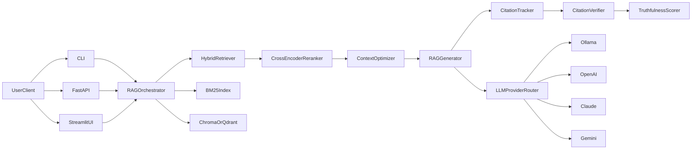
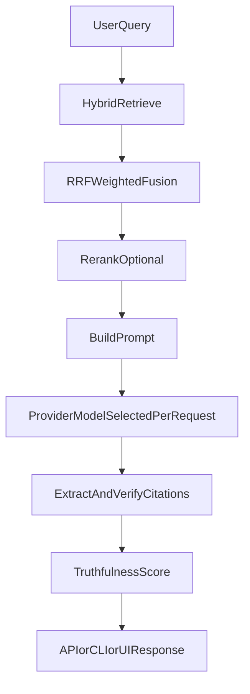

# Doc-Ingestion

Citation-aware RAG system for ingesting documents and generating grounded answers with truthfulness scores — CLI, API, and Streamlit UI.

> **[Try the live demo on Hugging Face Spaces](https://huggingface.co/spaces/vampokala/doc-ingestion)** — no install required.

## What it does

- Ingests `.pdf`, `.docx`, `.txt`, `.md`, `.html` files into a hybrid BM25 + vector index
- Retrieves using Reciprocal Rank Fusion across sparse and dense search, with optional cross-encoder reranking
- Generates answers via any LLM provider (Ollama, OpenAI, Anthropic, Gemini) with citation tracking
- Scores every response for **truthfulness** (NLI faithfulness + citation groundedness)
- Exposes a FastAPI backend and a Streamlit UI

---

## Quickstart

### Option 1 — Try online (no install)

Open the [Hugging Face Spaces demo](https://huggingface.co/spaces/vampokala/doc-ingestion). Sample documents about RAG, vector databases, and BM25 are pre-loaded. Paste your OpenAI, Anthropic, or Gemini key in the sidebar.

---

### Option 2 — Run locally with Docker (one command)

```bash
git clone https://github.com/vampokala/Doc-Ingestion
cd Doc-Ingestion
cp docker/.env.example docker/.env
# Edit docker/.env to add your API keys (OPENAI_API_KEY etc.)
docker compose -f docker/docker-compose.yml up
```

Open http://localhost:8501 (Streamlit UI) or http://localhost:8000 (API).

---

### Option 3 — Run from source (Python venv)

```bash
git clone https://github.com/vampokala/Doc-Ingestion
cd Doc-Ingestion
bash scripts/bootstrap_demo.sh   # creates venv, installs deps, ingests sample docs
```

The script pulls Ollama models automatically if Ollama is installed.
To use a cloud provider instead, skip Ollama and set:

```bash
export OPENAI_API_KEY=...
# or ANTHROPIC_API_KEY / GEMINI_API_KEY
```

Then start:

```bash
source .venv/bin/activate

# API server
PYTHONPATH=. uvicorn src.api.main:app --reload --port 8000

# Streamlit UI (second terminal)
PYTHONPATH=. streamlit run src/web/streamlit_app.py

# Or query from CLI
PYTHONPATH=. python -m src.query "What is RAG?"
```

---

## Features

- Multi-format ingestion (PDF, DOCX, TXT, MD, HTML)
- Hybrid retrieval — BM25 + vector with weighted RRF fusion
- Optional cross-encoder reranking (`cross-encoder/ms-marco-MiniLM-L-6-v2`)
- Multi-provider LLM routing: Ollama (local), OpenAI, Anthropic, Gemini — switchable per request
- Citation tracking and per-citation verification
- **Inline truthfulness scoring** on every response (NLI faithfulness + citation groundedness)
- **Offline eval harness** — RAGAS-style metrics over a golden dataset
- FastAPI with auth, rate limiting (Redis or in-memory), streaming SSE
- Streamlit UI with per-request provider/model switching and truthfulness badge

---

## Architecture

<details>
<summary>System diagram</summary>


</details>

<details>
<summary>Query flow</summary>


</details>

---

## API usage

```bash
uvicorn src.api.main:app --reload --port 8000
```

```bash
curl -X POST http://127.0.0.1:8000/query \
  -H "X-API-Key: dev-key-1" \
  -H "Content-Type: application/json" \
  -d '{"query": "What is hybrid retrieval?", "provider": "ollama", "model": "qwen2.5:7b"}'
```

Response includes a `truthfulness` block:

```json
{
  "answer": "Hybrid retrieval combines BM25 sparse search with dense vector search...",
  "truthfulness": {
    "nli_faithfulness": 0.87,
    "citation_groundedness": 0.91,
    "uncited_claims": 1,
    "score": 0.89
  },
  "citations": [...]
}
```

Endpoints: `GET /health`, `GET /metrics`, `POST /query`, `POST /query/stream` (SSE).

---

## Evaluation

### Inline (every response)

Every `/query` response includes a `truthfulness` object with:

| Field | What it measures |
|-------|-----------------|
| `nli_faithfulness` | Fraction of response sentences entailed by the retrieved chunks (NLI model) |
| `citation_groundedness` | Mean citation verification score |
| `uncited_claims` | Count of sentences without a citation marker |
| `score` | Weighted aggregate (60% NLI + 40% groundedness) |

The Streamlit UI renders a coloured badge: 🟢 ≥ 0.8 / 🟡 0.5–0.8 / 🔴 < 0.5.

### Offline batch evaluation

Run the RAGAS-style harness against the included golden dataset:

```bash
# Install eval extras
pip install -r requirements/eval.txt

# Run against full dataset (needs a running LLM)
PYTHONPATH=. python -m evals.run_evals \
  --dataset evals/datasets/sample.jsonl \
  --judge-provider ollama \
  --judge-model qwen2.5:7b \
  --output evals/reports/

# Smoke test (no LLM required — for CI / quick check)
PYTHONPATH=. python -m evals.run_evals \
  --dataset evals/datasets/smoke.jsonl \
  --mock \
  --no-nli \
  --output evals/reports/
```

Reports are written to `evals/reports/` as JSON + Markdown.

---

## Project map

| Path | Purpose |
|------|---------|
| `src/core/` | Retrieval, reranking, generation, citations, orchestration |
| `src/api/` | FastAPI models and routes |
| `src/web/` | Streamlit UI and ingestion service |
| `src/evaluation/` | Truthfulness scorer, generation and retrieval metrics |
| `src/utils/` | Config and vector database integrations |
| `evals/` | Offline eval harness, golden datasets, RAGAS adapter |
| `data/sample/` | Pre-ingested sample documents for demos |
| `spaces/` | Hugging Face Spaces deployment files |
| `docker/` | Docker Compose stack (API + Streamlit + Redis + Qdrant) |
| `Docs/` | Roadmap, runbook, and phase documentation |

---

## Development

```bash
.venv/bin/python -m pytest tests/unit -q
.venv/bin/python -m pytest tests/integration -q
```

Multi-provider API key environment variables:

```bash
export OPENAI_API_KEY=...
export ANTHROPIC_API_KEY=...
export GEMINI_API_KEY=...
```

---

## Troubleshooting

- **Empty results after ingest:** Run `python -m src.ingest --docs data/documents` and verify `data/embeddings/` exists.
- **Embedding model error:** Ensure Ollama is running and `nomic-embed-text` is pulled, or switch to a different embedding provider in `config.yaml`.
- **Dimension mismatch after model change:** Re-ingest all documents to rebuild the vector index.
- **Cloud provider fails:** Check the relevant `*_API_KEY` env var is set.
- **Truthfulness score always 0:** The NLI model (`cross-encoder/nli-deberta-v3-small`) downloads on first use (~140 MB). Check internet access or set `evaluation.inline_enabled: false` in `config.yaml` to disable.

---

## Documentation

- [Production Runbook](Docs/RUNBOOK.md)
- [Roadmap](Docs/ROADMAP.md)
- [Project overview](Docs/PROJECT_OVERVIEW.md)
